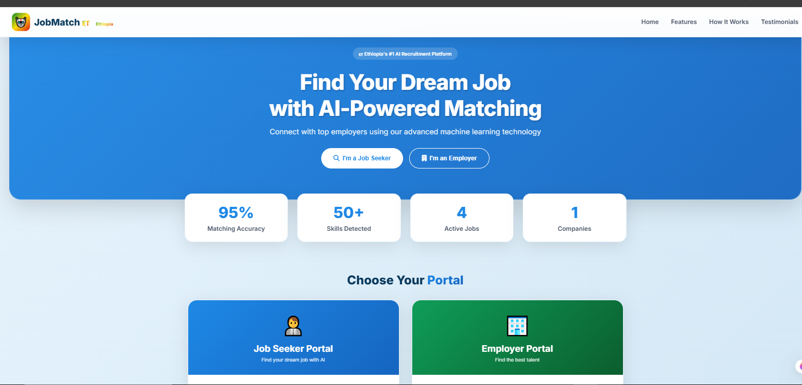

# 🎯 JobMatch ET - AI-Powered Job Matching Platform for Ethiopia

## 📌 Overview

**JobMatch ET** is an AI-powered recruitment and job recommendation platform built for the Ethiopian job market.

The platform uses **Machine Learning (Random Forest)** and intelligent matching algorithms to connect job seekers with suitable opportunities based on skills, experience, education, and job requirements.

The system helps employers find qualified candidates faster while helping job seekers discover relevant career opportunities.

---

# 🚀 Live Demo & Links

🌐 **Frontend Live Demo:**  
https://famous-pasca-9093d1.netlify.app

⚙️ **Backend API:**  
https://job-matchit.onrender.com

📖 **API Documentation:**  
https://job-matchit.onrender.com/docs

💻 **GitHub Repository:**  
https://github.com/sam-uelt50/Job-MatchIT

---
# 📸 Screenshots

## Landing Page

## 🤖 AI Job Matching Dashboard

## 👨‍💻 Job Seeker Dashboard

## 🏢 Employer Dashboard

## 📌 Job Posting Dashboard

## 📄 Application Dashboard

# 💼 Portfolio Description

## JobMatch ET — AI-Powered Job Matching Platform

A full-stack AI recruitment platform that uses **Machine Learning and NLP-based matching techniques** to recommend jobs and rank candidates.

Built with **FastAPI, JavaScript, SQLite, and Random Forest ML**, the platform provides candidate profiles, employer job management, AI recommendations, and automated candidate matching.

**Key Highlights:**

- 🤖 AI job recommendation engine
- 📊 Random Forest ML model with 78.5% accuracy
- 👨‍💻 Candidate and employer dashboards
- 📄 CV/profile management system
- 🔐 Secure JWT authentication
- 🌍 Deployed frontend and backend system

---

# 🛠️ Technology Stack

**Frontend**
- HTML5
- CSS3
- JavaScript

**Backend**
- Python
- FastAPI
- REST API
- JWT Authentication

**Database**
- SQLite

**Machine Learning**
- Scikit-learn
- Random Forest
- NLP Processing

**Deployment**
- Netlify (Frontend)
- Render (Backend)

---